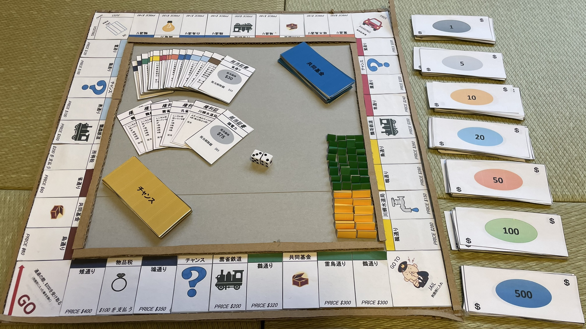

# 概要

ボードゲーム「モノポリー」を、段ボールと工作用紙を用いて自作しました。

盤面だけでなく、カード、紙幣、権利証、住宅など、ゲームを遊ぶために必要なものを一から制作しています。
見た目を再現するだけでなく、実際に繰り返し遊べるよう、耐久性や小物の扱いやすさも意識しました。

2017年ごろに個人で制作した作品です。

# 制作の動機

昔からものづくりが好きで、当時は特に、既存のものを自分の手で再現することに興味を持っていました。

モノポリーを知った際、盤面やカードを観察して、「これなら自分でも作れるのではないか」と考えたことが制作のきっかけです。
また、当時は市販品を気軽に購入できなかったため、それならば自分で作ってみようと考えました。

# 作品の特徴

ゲームの基本的なルールやマスの構成、カードの種類などは、原作のモノポリーを参考にしています。

一方で、通りの名称には独自の要素を取り入れました。当時の自分のあだ名が「キジ」だったことから、すべての通りを鳥の名前で統一しています。

市販品をそのまま模倣するだけではなく、自分なりのテーマを加えることで、オリジナルの作品にしました。

# 制作方法

主な材料には、工作用紙、段ボール、印刷用紙を使用しました。

盤面、紙幣、通りの権利証などの印刷物はExcel上でレイアウトを作成し、印刷後に工作用紙や段ボールへ貼り付けています。
住宅などの小物類についても、ゲーム中に扱える大きさを考えながら制作しました。

盤面に使用する一部の画像については、Web上の画像を参考にしています。

# 工夫した点

## 耐久性を持たせる

紙だけでは繰り返し遊ぶうちに傷んでしまうため、盤面の土台に段ボールを使用しました。

カードや権利証などについても、扱いやすさや強度を考えながら紙の厚さを調整しています。
その結果、制作から約10年が経過した現在でも、問題なく遊べる状態を保っています。

## 住宅を配置しやすくする

市販のボードゲームのような立体感を持たせるため、盤面の縁を細長く切った段ボールで囲みました。

この縁は見た目を整えるだけでなく、通りのマスに住宅を配置する際の目印にもなっています。
盤面上で住宅がずれにくくなり、遊びやすさの向上にもつながりました。

## 細部まで一貫して制作する

盤面だけを作るのではなく、紙幣、カード、権利証、住宅など、ゲームに必要な要素を一通り制作しました。

作品単体の見た目だけでなく、実際にゲームとして成立し、最後まで遊べることを重視しました。

# 完成後

完成後は中学の友達といっしょに遊んだほか、高専の寮へ持ち込んで休日に談話室で友人と遊びました。

自分で作ったものを実際に人に使ってもらい、一緒に楽しめたことは印象に残っています。
単にものを完成させるだけではなく、使う人や遊ぶ場面まで想像しながら作ることの面白さを実感した作品です。
