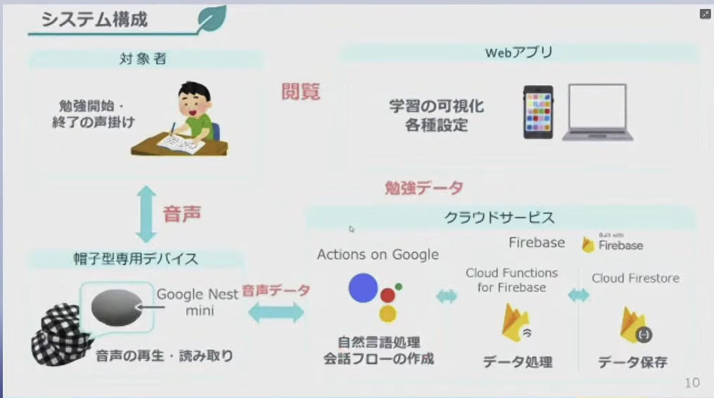

# 概要

学習管理アプリには、スマホを使うものがあるが、スマホの利用によって、SNS などの誘惑にそれてしまい、学習時間があまりとれないという現状があります。
そのため、勉強中にスマホなしで学習アプリの機能を利用できる仕組みが理想であると考えました。
また、さらに学習意欲を高めるには、「褒める」ことが効果的であることがわかっています。

そこで、スマホを利用せずに学習を記録・管理でき、更にほめてくれることで勉強のモチベを上げてくれる、帽子型デバイスと Web アプリを用いた学習管理・記録システム
である「モチベアゲ太郎」を開発しました。

勉強を始めるときは、デバイスに対して「今から勉強を始めるよ」などと声を掛けるだけで始めることができます。
勉強中は、デバイスがユーザを褒めることで、学習意欲を維持することができます。
勉強を終える際も、デバイスに対して声を掛けることで終わることができます。

勉強後や勉強時間外では、Web アプリを使って、勉強時間の累積や獲得したバッジ等で、頑張りを確認することができます。

# プレゼンの映像

<YouTube id="GpcsrOywmHA" start="433" title="モチベアゲ太郎 demo" />

# メンバー構成

- メインメンバー: 4人
  - 企画から開発まで携わった方々
- サブメンバー: 2人
  - 企画が本戦に通ってから開発に携わった人たち
  - 筆者はこのうちの1人

## 担当内訳

- 開発リーダー: 1人
  - 専攻科1年 (当時) の先輩が担当
  - フロントエンド、バックエンドの両方をどちらもみていた感じ
  - 本番環境への移行も担当
- フロントエンド: 3人
  - Vue2 によるフロントエンドを担当
  - 主に構成画面ごとで分担した
- バックエンド: 1人
  - firebase による API 作成および Google Cloud Text-to-Speech による合成音声の作成を担当
- デザイナー: 1人
  - 自分の好きな写真をサムネイルにできる「アゲアバター」のデザインを担当

# 自身が担当した箇所の詳細
私は主に、フロントエンドの画面作成を行いました。
担当した画面および機能は以下のとおりです。

- ホーム画面
  - 学習時間によって、アゲアバターのツタを登った高度が変わり、それに応じて建築物や山が出現する機能
  - アゲアバターのアバター写真の登録機能
- 設定画面
  - 1セットの勉強 / 休憩する時間の設定機能（ポモドーロ的な仕様）

また、プレゼン時の動画の撮影および編集も担当しました。

# プロコンの開発に携わってみて
私にとってはじめてのチーム開発であり、はじめてのWeb開発でした。
node.js も Vue も触るのは初めてでしたが、とても新鮮で楽しかった記憶があります。

チーム開発では、開発リーダーの先輩がひっぱってくれたこともあり、開発は滞りなく進んでいたと思います。
はじめてのチーム開発でしたが、以下のことを意識していました。

- わからないことがあれば調べて、それでもわからなければ先輩に聞く
  - 先輩になんでもかんでも聞くのではなく、自分なりに考えたうえで質問をする
- 必要そうな機能があれば先回りして開発する
  - 勉強セットの作成画面を制作した際、削除機能も必要だと思い、まとめて実装した
- 進捗の報告を密にする
  - 毎日、集まって開発し、リアルでの会話を重視する

この開発を通して、チームで効率的に作業をすすめ、成果を出すためには、割り当てられた作業をこなすだけでなく、プロダクト全体を見ながら必要なことを考え、自ら行動することが重要だと学びました。

「モチベアゲ太郎」は、私にとって初めてのWeb開発・チーム開発であると同時に、その後もWebアプリケーション開発を続けていくきっかけとなった作品です。
このプロコンの制作に係らなければ、その後の iQbe の開発およびその後の卒業研究、そして Web 系企業への就活などもなかったと考えると、私自身のプログラミング歴にとってターニングポイントになった経験だと思います。

この経験で得た、分からないことを自ら調べる姿勢、周囲と進捗を共有する習慣、必要な機能を考えて行動する姿勢を、その後の個人開発や研究でも生かしています。
